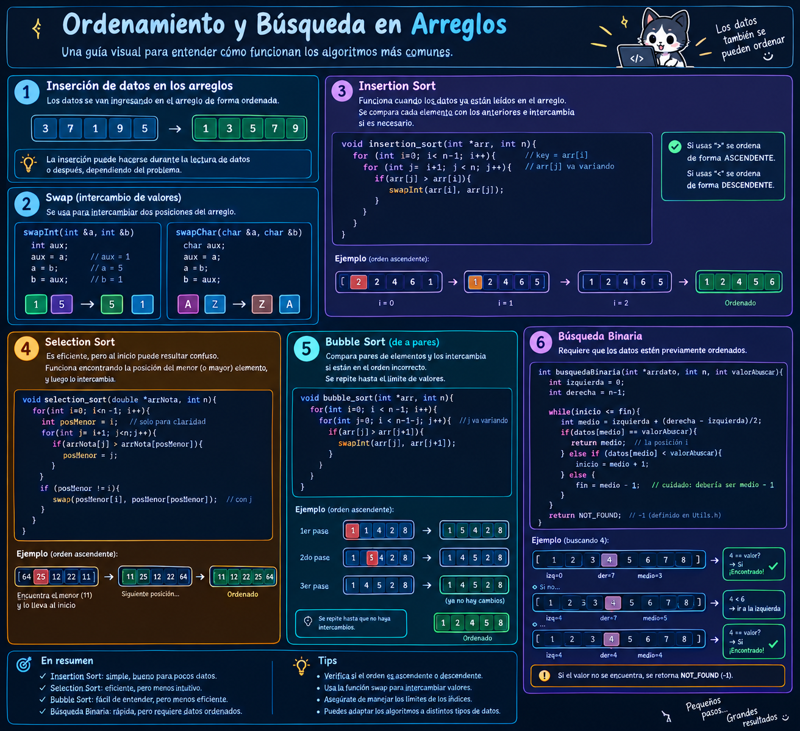

## 🧠 Ordenamiento y búsqueda

### 📖 Guía visual

  

### 🎮 Simulador interactivo

¿Quieres ver cómo funcionan los algoritmos paso a paso?

> Prueba diferentes arreglos, avanza paso a paso y observa qué ocurre
> con `i`, `j`, `posMenor`, `medio`, `izquierda` y `derecha`.
